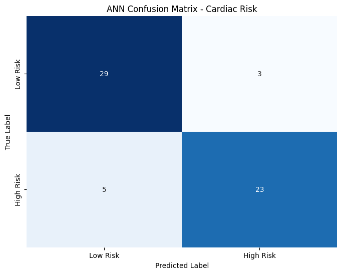
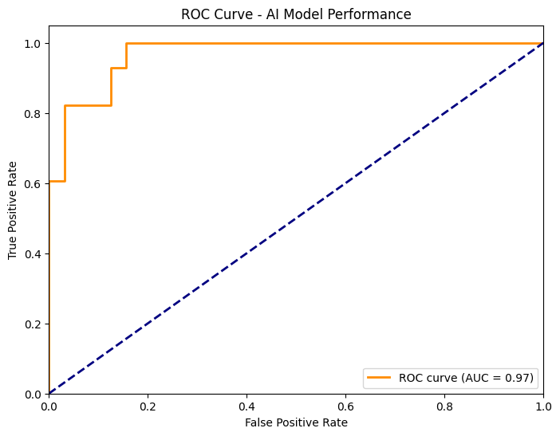
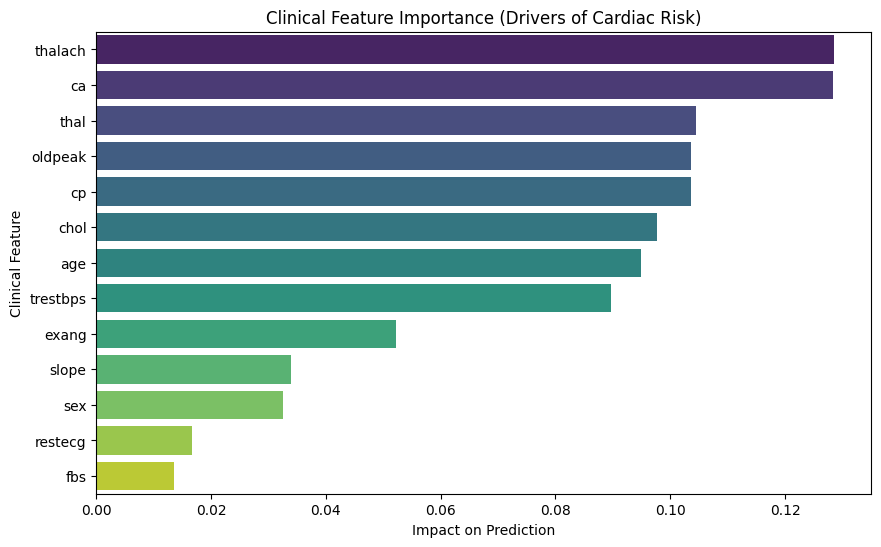
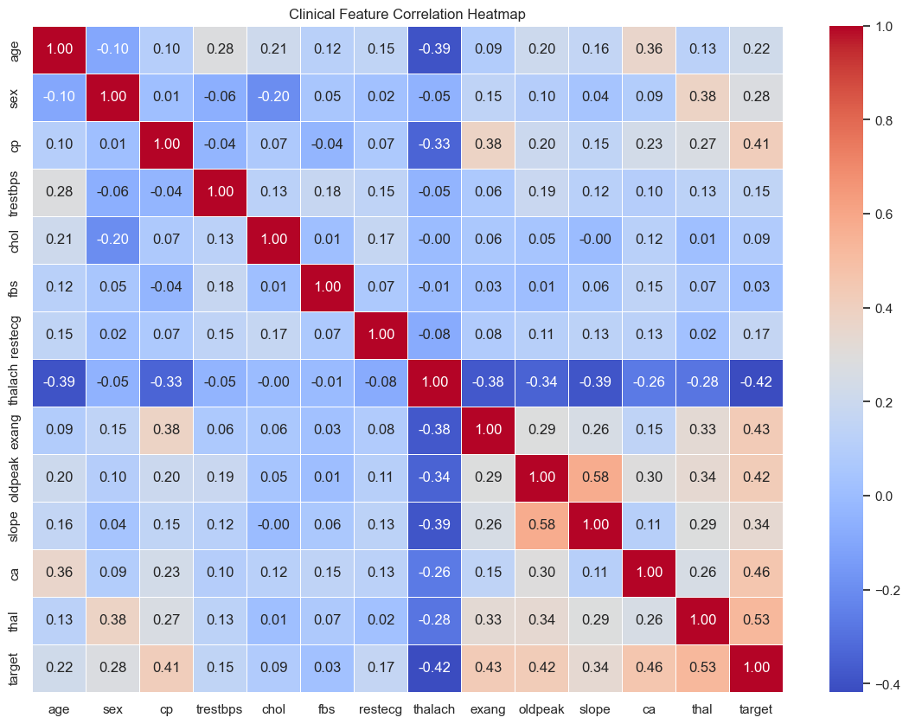
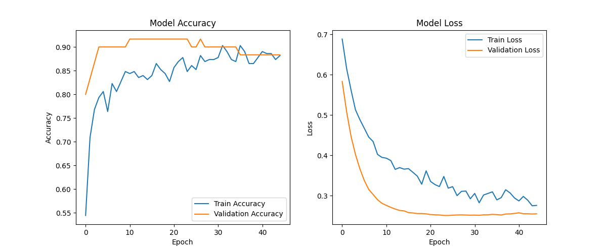

# Cardiac Risk Prediction System


## Project Overview
The **Cardiac Risk Prediction System** is a high-performance, machine learning-driven platform designed to predict the likelihood of cardiac disease based on clinical parameters. By integrating a hyper-optimized Artificial Neural Network (ANN), this system effectively addresses the "black-box" explainability problem often associated with deep learning models in healthcare. It provides clinicians with a reliable, accurate, and interpretative tool to aid in early diagnosis and patient risk assessment, bridging the gap between advanced predictive analytics and actionable medical insights.

## System Architecture
This project implements a highly decoupled microservice architecture to ensure scalability, maintainability, and clear separation of concerns:
*   **Backend Brain:** A robust REST API powered by FastAPI that serves the hyper-optimized Artificial Neural Network model. It handles all data validation, preprocessing, and inference requests.
*   **Frontend Face:** An interactive, user-friendly interface built with Streamlit that consumes the backend API. It allows end-users to input clinical parameters and instantly visualize prediction outcomes.

## Tech Stack
*   **Python**
*   **FastAPI**
*   **Streamlit**
*   **TensorFlow/Keras**
*   **Scikit-learn**
*   **Pandas**

## Project Structure
```text
├── data/                   # Dataset files (heart.csv)
├── models/                 # Compiled models (heart_ann_model.keras)
├── outputs/                # Generated graphs (ROC, Confusion Matrix, etc.)
├── src/                    # Core microservice logic
│   ├── api.py              # FastAPI Backend Brain
│   ├── train_model.py      # ANN training pipeline
│   └── evaluate_model.py   # Performance metrics generator
└── app.py                  # Streamlit Frontend Face
```

## Bare-Metal Installation Guide (Strictly Localhost)
Follow these exact terminal commands to set up the virtual environment, install requirements, and boot the system manually.

**Prerequisites:** Ensure Python is installed on your system.

**1. Create and Activate Virtual Environment**
```bash
# Create a virtual environment named 'venv'
python -m venv venv

# Activate the virtual environment (Windows)
.\venv\Scripts\activate

# Activate the virtual environment (Linux/macOS)
source venv/bin/activate
```

**2. Install Dependencies**
```bash
pip install -r requirements.txt
```

**3. Boot the System**
The system requires both the backend API and the frontend UI to be running simultaneously in separate terminal instances.

**Step 1: Boot the API (Terminal 1)**
Make sure your virtual environment is activated, then run:
```bash
uvicorn src.api:app --host 127.0.0.1 --port 8080
```

**Step 2: Boot the UI (Terminal 2)**
Open a *new* terminal window, activate the virtual environment again, and run:
```bash
streamlit run app.py
```

## API Contract
The backend exposes a `/predict` POST endpoint for model inference.

### Request Payload
The endpoint expects a JSON payload matching the following Pydantic schema structure:

```json
{
  "age": 52,
  "sex": 1,
  "cp": 0,
  "trestbps": 125,
  "chol": 212,
  "fbs": 0,
  "restecg": 1,
  "thalach": 168,
  "exang": 0,
  "oldpeak": 1.0,
  "slope": 2,
  "ca": 2,
  "thal": 3
}
```

## Technical Deep Dive & Mathematical Foundations

### 1. Data Engineering & Preprocessing
*   **Standardization:** The `StandardScaler` from Scikit-Learn is used to normalize clinical features (bringing mean to 0 and variance to 1) to ensure stable gradient descent.
*   **Data Splitting:** The dataset is partitioned using a standard train/test dataset splitting strategy.

### 2. Neural Network Architecture & Functions
The core predictive model utilizes a `Sequential` model structure:
*   **Dense Layers:** Utilized for fully connected networks to extract complex patterns from clinical variables.
*   **ReLU Activation:** Hidden layers use the ReLU activation function to introduce non-linearity.
*   **Dropout Layer (0.2):** Used as a regularization technique to randomly deactivate 20% of neurons and prevent overfitting.

### 3. Mathematical Foundations
*   **Output Activation:** The final layer uses the Sigmoid activation function to squash outputs into a probability distribution between 0 and 1.
    $f(x) = \frac{1}{1 + e^{-x}}$
*   **Loss Function:** The model minimizes Binary Cross-Entropy Loss, ideal for binary classification tasks.
    $L = -\frac{1}{N} \sum [y_i \log(\hat{y}_i) + (1 - y_i) \log(1 - \hat{y}_i)]$
*   **Optimizer:** Utilizes the Adam Optimizer for adaptive learning rate optimization.

### 4. Graphical Outputs & Explainability
*   **Exploratory Data Analysis (EDA):** Correlation heatmaps and feature distributions.
*   **Training Monitoring:** Loss/Accuracy curves plotted per epoch to visually prove the early stopping mechanism and absence of overfitting.
*   **Model Explainability:** A feature importance graph (driven by a Random Forest proxy) used to visually explain to clinicians which patient metrics (e.g., max heart rate, chest pain) drive the ANN's predictions.

## Model Performance
*   The ANN achieved approximately **90% accuracy**, outperforming baseline models like Random Forest (**88.3%**) and Logistic Regression (**86.6%**).
*   The evaluation includes a **Confusion Matrix** to show minimized False Negatives for medical safety.
*   The evaluation includes a **Receiver Operating Characteristic (ROC) Curve** demonstrating an AUC close to **1.0**, indicating high separability between risk classes.

## System Previews

**1. Model Evaluation (Medical Safety Metrics)**



**2. Model Explainability**


**3. Data Engineering & Training Monitoring**


